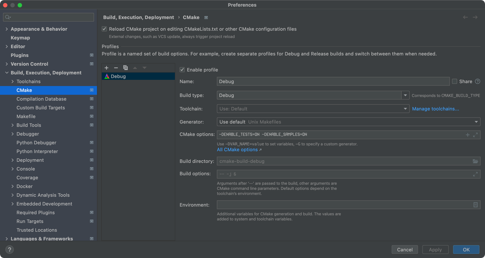

# wheels
Core C++ components

- [Components](wheels)
- [Samples](samples)
- [Tests](tests)

## Integration
### CMake
#### Embedded (FetchContent)
Since CMake v3.11, [FetchContent](https://cmake.org/cmake/help/v3.11/module/FetchContent.html) can be used to automatically downloaded the repository as a dependency at configure time.
Example
```cmake
include(FetchContent)

FetchContent_Declare(
        wheels
        GIT_REPOSITORY https://github.com/KirillDanilchuk/wheels.git
        GIT_TAG origin/main
)

FetchContent_MakeAvailable(wheels)

target_link_libraries(${PROJECT_NAME} PRIVATE wheels)
```

Example project how to use library https://github.com/KirillDanilchuk/wheels-cmake-test

#### Enable samples and/or tests

To enable samples and/or tests in 
`Preferences | Build, Execution, Deployment | CMake | CMake options`
add `-DENABLE_TESTS=ON -DENABLE_SAMPLES=ON`
